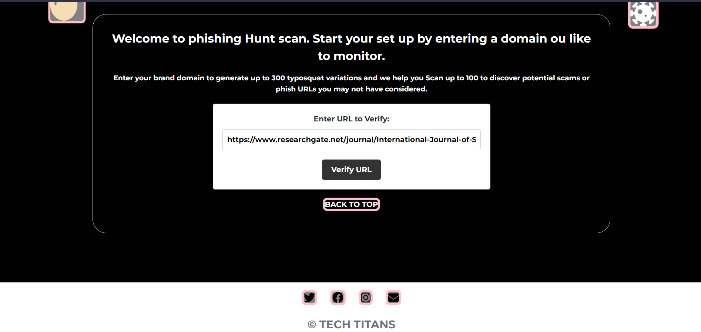

# Phishing Detection Website using AI/ML



## Introduction

Welcome to the Phishing Detection Website repository! This web application utilizes Artificial Intelligence and Machine Learning to help users identify and protect themselves from phishing websites. It's designed to provide an easy-to-use interface for users to check the legitimacy of URLs.

## Features

- **URL Scanning:** Users can enter a URL, and the system will analyze it using AI/ML algorithms to determine if it's likely a phishing website.

- **Real-time Results:** Instantaneous results are provided, indicating the likelihood of the given URL being a phishing site.

- **User-friendly Interface:** The website features an intuitive and user-friendly design to make it accessible for both technical and non-technical users.

## Technologies Used

- **Python:** The core of the AI/ML models is written in Python.

- **Flask:** The web application is built using Flask, a lightweight Python web framework.

- **Scikit-Learn:** Machine learning models are trained and implemented using Scikit-Learn.

- **HTML/CSS/Python:** Frontend design and interactivity are handled with web technologies.

## Getting Started

To run this web application locally, follow these steps:

1. **Clone the Repository:** Use Git to clone this repository to your local machine.

   ```
   git clone https://github.com/PrnvGiri/Phishing-URL-Detector.git
   ```

2. **Install Dependencies:** Navigate to the project directory and install the required Python packages using pip.

   ```
   cd Phishing-URL-Detector
   pip install -r requirements.txt
   ```

3. **Run the Application:** Start the Flask application.

   ```
   python app3.py
   ```

4. **Access the Website:** Open a web browser and go to `http://localhost:5000` to access the locally hosted website.

## Usage

1. Open the website in your browser.

2. Enter a URL that you want to check for phishing.

3. Click the "Verify URL" button.

4. Wait for the system to analyze the URL and provide the phishing likelihood score.

## Contribution

We welcome contributions from the open-source community to enhance and improve this phishing detection system. If you'd like to contribute, please follow these steps:

1. Fork the repository.

2. Create a new branch for your feature or bug fix.

3. Make your changes and commit them with clear and concise messages.

4. Push your changes to your forked repository.

5. Create a pull request, describing the changes you've made and why they should be merged.


## Contact

If you have any questions or feedback, feel free to contact us at [pranav.giri.35@gmail.com](mailto:pranav.giri.35@gmail.com).
